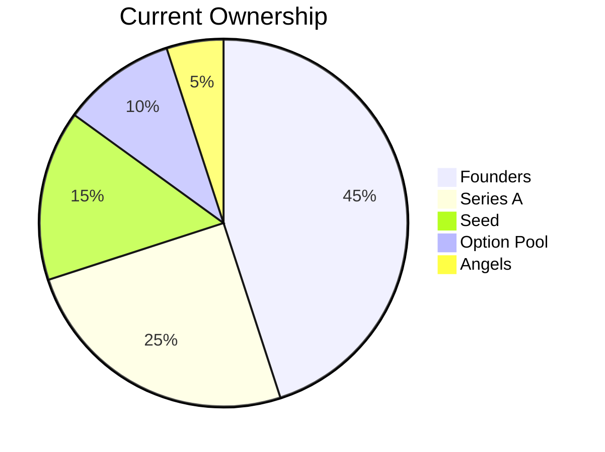
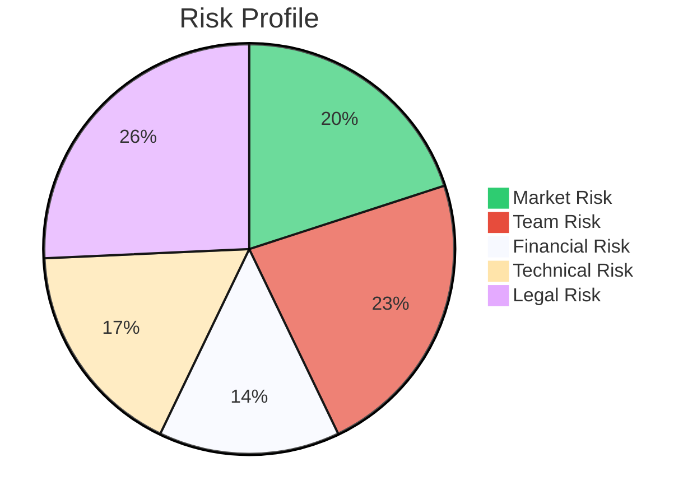
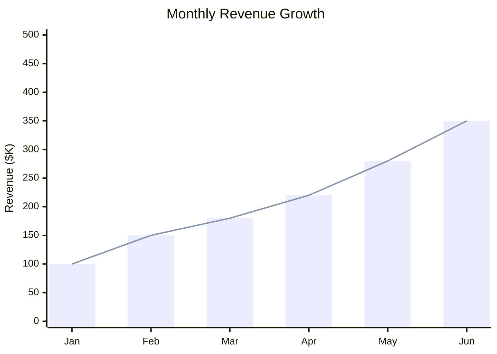
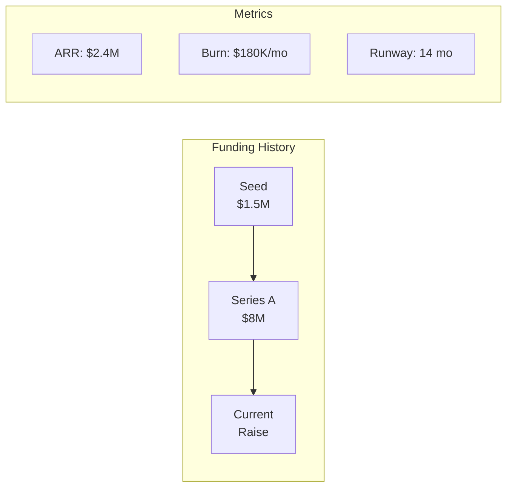
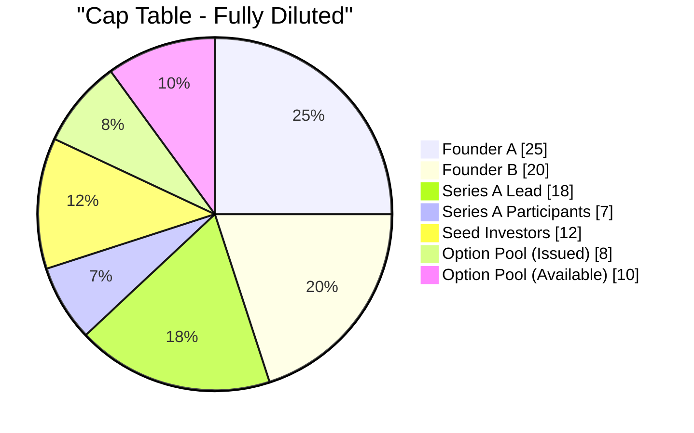
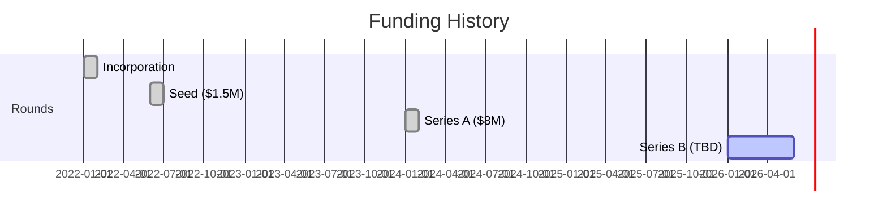
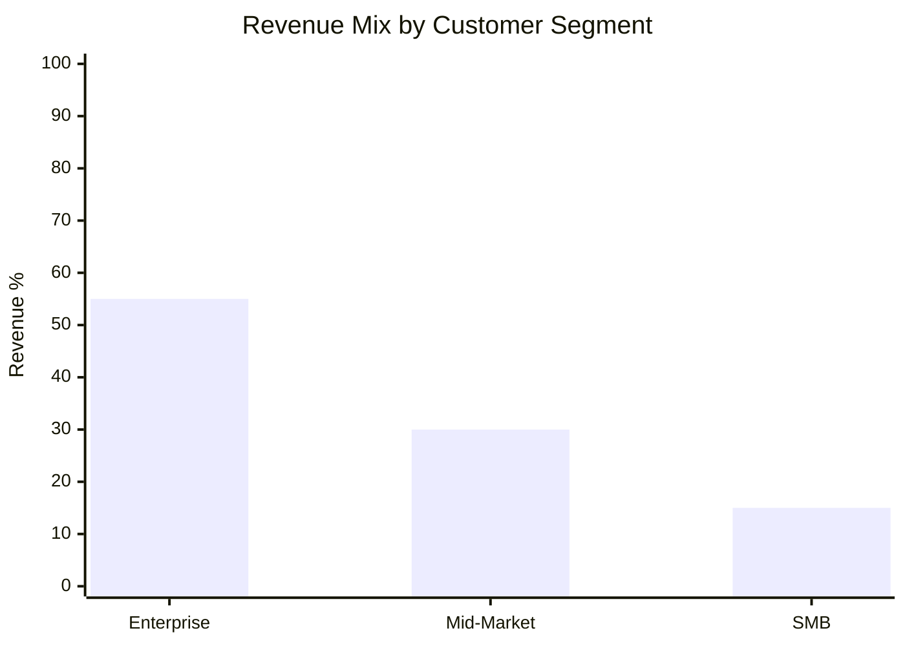
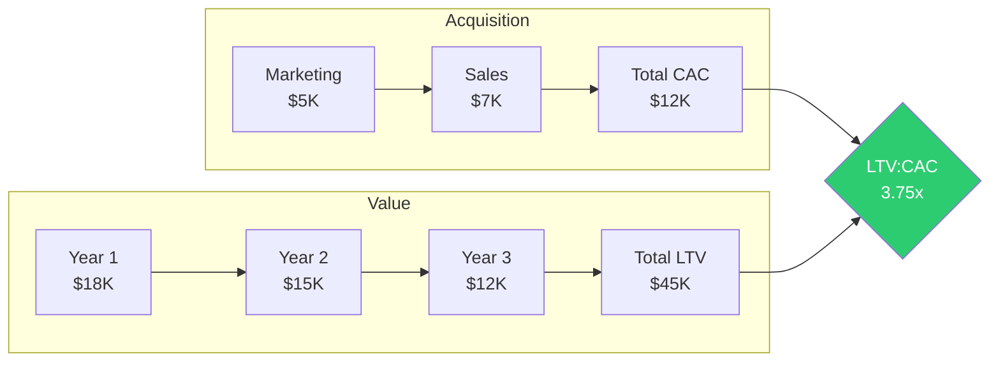

# Diligence Report Generator

Compiles all data room analysis into a professional, executive-ready PDF report with embedded visualizations.

## Capabilities

- Compile multiple markdown analysis files into single PDF
- Generate Mermaid charts for visual data representation
- Create executive summary with key metrics at-a-glance
- Format for quick scanning (traffic lights, score cards, tables)
- Export print-ready and digital versions

## Report Structure

```
┌─────────────────────────────────────────────────────────────────┐
│                    DILIGENCE REPORT                              │
├─────────────────────────────────────────────────────────────────┤
│  1. EXECUTIVE SUMMARY (1 page)                                  │
│     • Company snapshot                                          │
│     • Investment thesis                                         │
│     • Key metrics dashboard                                     │
│     • Risk score traffic light                                  │
│                                                                 │
│  2. METRICS ANALYSIS (2-3 pages)                               │
│     • Revenue & growth charts                                   │
│     • Unit economics (LTV, CAC, payback)                       │
│     • Cohort retention heatmap                                  │
│     • Burn & runway visualization                               │
│                                                                 │
│  3. CAP TABLE & OWNERSHIP (1-2 pages)                          │
│     • Current ownership pie chart                               │
│     • Round modeling scenarios                                  │
│     • Waterfall analysis chart                                  │
│                                                                 │
│  4. RISK ASSESSMENT (1-2 pages)                                │
│     • 11-Risks scorecard                                        │
│     • Risk radar chart                                          │
│     • Mitigation recommendations                                │
│                                                                 │
│  5. CUSTOMER ANALYSIS (1 page)                                 │
│     • Concentration chart                                       │
│     • Top customers table                                       │
│                                                                 │
│  6. MARKET CONTEXT (1 page)                                    │
│     • Austin ecosystem positioning                              │
│     • Comparable valuations                                     │
│                                                                 │
│  7. APPENDIX                                                    │
│     • Detailed financials                                       │
│     • Full cap table                                            │
│     • Data sources                                              │
└─────────────────────────────────────────────────────────────────┘
```

## Workflow

### Phase 1: Gather Source Files

```python
SOURCE_FILES = {
    "metrics": "data-room/analysis/metrics.json",
    "cap_table": "data-room/analysis/parsed_captable.json",
    "risk_scorecard": "data-room/output/risk-scorecard.md",
    "investment_memo": "data-room/output/investment-memo.md",
    "cohorts": "data-room/analysis/cohorts.xlsx",
    "waterfall": "data-room/analysis/waterfall.xlsx",
    "flags": "data-room/analysis/flags.md"
}
```

### Phase 2: Generate Mermaid Visualizations

Use Mermaid Chart MCP to create embedded visualizations.

**Ownership Pie Chart:**


**Risk Radar:**


**Revenue Growth:**


**Funding Flow:**


### Phase 3: Build PDF with ReportLab

```python
from reportlab.lib.pagesizes import letter
from reportlab.platypus import SimpleDocTemplate, Paragraph, Spacer, Image, Table, PageBreak
from reportlab.lib.styles import getSampleStyleSheet, ParagraphStyle
from reportlab.lib.colors import HexColor
from reportlab.lib.units import inch

# Custom styles for Crowley Capital
CROWLEY_BLUE = HexColor('#1a365d')
CROWLEY_GOLD = HexColor('#d69e2e')

def create_diligence_report(company_name: str, data: dict, output_path: str):
    """Generate complete diligence PDF report."""
    doc = SimpleDocTemplate(output_path, pagesize=letter)
    story = []
    
    # Cover page
    story.append(create_cover_page(company_name))
    story.append(PageBreak())
    
    # Executive summary
    story.extend(create_executive_summary(data))
    story.append(PageBreak())
    
    # Metrics section
    story.extend(create_metrics_section(data['metrics']))
    story.append(PageBreak())
    
    # Cap table section
    story.extend(create_captable_section(data['cap_table']))
    story.append(PageBreak())
    
    # Risk assessment
    story.extend(create_risk_section(data['risks']))
    
    doc.build(story)
```

### Phase 4: Integrate Charts

The Mermaid Chart MCP renders diagrams to images:

```python
# Use Mermaid Chart MCP
mermaid_code = """
pie title Ownership Structure
    "Founders" : 45
    "Investors" : 40
    "Pool" : 15
"""

# MCP renders and returns image URL/path
chart_image = mermaid_chart_mcp.render(mermaid_code)

# Embed in PDF
from reportlab.platypus import Image
chart = Image(chart_image, width=4*inch, height=3*inch)
story.append(chart)
```

## Visual Components

### Executive Dashboard (Page 1)

```
┌─────────────────────────────────────────────────────────────────┐
│  COMPANY NAME                           Crowley Capital          │
│  Due Diligence Report                   January 2026            │
├─────────────────────────────────────────────────────────────────┤
│                                                                 │
│  ┌─────────────┐ ┌─────────────┐ ┌─────────────┐ ┌───────────┐ │
│  │ ARR         │ │ Growth      │ │ Burn        │ │ Runway    │ │
│  │ $2.4M       │ │ 142% YoY    │ │ $180K/mo    │ │ 14 months │ │
│  │ ▲ 12% MoM   │ │ ✓ Target    │ │ ▼ Improving │ │ ✓ Safe    │ │
│  └─────────────┘ └─────────────┘ └─────────────┘ └───────────┘ │
│                                                                 │
│  RISK SCORE: 7.2/10              RECOMMENDATION: PROCEED        │
│  ████████░░                      ✓ Investment Committee Review  │
│                                                                 │
│  ┌──────────────────────────────┐  ┌─────────────────────────┐ │
│  │     [OWNERSHIP PIE CHART]    │  │   [REVENUE LINE CHART]  │ │
│  │                              │  │                         │ │
│  └──────────────────────────────┘  └─────────────────────────┘ │
│                                                                 │
│  KEY STRENGTHS                     KEY RISKS                    │
│  • Strong NRR (125%)               • Customer concentration    │
│  • Experienced team                • Long sales cycles         │
│  • Capital efficient               • Competitive pressure      │
│                                                                 │
└─────────────────────────────────────────────────────────────────┘
```

### Metrics Tables

```
┌─────────────────────────────────────────────────────────────────┐
│  UNIT ECONOMICS                                                 │
├─────────────────┬─────────────┬─────────────┬─────────────────┤
│  Metric         │  Current    │  Benchmark  │  Status         │
├─────────────────┼─────────────┼─────────────┼─────────────────┤
│  LTV            │  $45,000    │  $30,000    │  🟢 Above       │
│  CAC            │  $12,000    │  $15,000    │  🟢 Below       │
│  LTV:CAC        │  3.75x      │  3.0x       │  🟢 Healthy     │
│  Payback        │  8 months   │  12 months  │  🟢 Fast        │
│  Gross Margin   │  72%        │  70%        │  🟢 On Target   │
│  Net Retention  │  125%       │  110%       │  🟢 Excellent   │
└─────────────────┴─────────────┴─────────────┴─────────────────┘
```

### Risk Scorecard Visual

```
┌─────────────────────────────────────────────────────────────────┐
│  11-RISKS ASSESSMENT (Tunguz Framework)                         │
├─────────────────────────────────────────────────────────────────┤
│                                                                 │
│  MARKET         ████████░░ 8/10    Product-market fit proven   │
│  PRODUCT        ███████░░░ 7/10    Tech debt manageable        │
│  TEAM           █████████░ 9/10    Strong founding team        │
│  FINANCIAL      ██████░░░░ 6/10    Burn needs attention        │
│  COMPETITION    ███████░░░ 7/10    Defensible moat             │
│  TIMING         ████████░░ 8/10    Market tailwinds            │
│  REGULATORY     █████████░ 9/10    Low regulatory risk         │
│  CUSTOMER       ██████░░░░ 6/10    Concentration concern       │
│  TECHNOLOGY     ████████░░ 8/10    Scalable architecture       │
│  LEGAL          █████████░ 9/10    Clean cap table             │
│  EXECUTION      ███████░░░ 7/10    Solid track record          │
│                                                                 │
│  COMPOSITE SCORE: 7.6/10          RISK LEVEL: MODERATE         │
│                                                                 │
└─────────────────────────────────────────────────────────────────┘
```

## Mermaid Chart Templates

### Ownership Structure


### Funding Timeline


### Revenue Composition


### Unit Economics Flow


## Command Usage

```bash
# Generate report from CLI
python scripts/generate_report.py \
  --company "Sample Corp" \
  --data-room ./data-room \
  --output ./data-room/output/diligence-report.pdf \
  --format executive  # or detailed

# Options
--format executive    # 8-10 pages, high-level
--format detailed     # 20+ pages, full analysis
--format ic           # Investment Committee format
--include-appendix    # Add raw data appendix
--charts-only         # Export just the Mermaid charts
```

## Integration Points

### Input from Other Skills
| Skill | Data Used |
|-------|-----------|
| saas-metrics | metrics.json, cohort data |
| cap-table-modeling | parsed_captable.json, waterfall |
| risk-framework | risk-scorecard.md, scores |
| business-fin-analyst | P&L analysis, burn rate |
| contract-review | Legal flags summary |
| austin-market | Comparable valuations |
| carta-integration | Real-time cap table data |

### Mermaid Chart MCP Integration
```python
# Generate and render Mermaid charts
from mermaid_chart_mcp import render_diagram

# Ownership pie chart
ownership_chart = render_diagram(
    diagram_type="pie",
    mermaid_code=ownership_mermaid,
    client_name="claude"
)

# Revenue growth chart  
revenue_chart = render_diagram(
    diagram_type="xychart-beta",
    mermaid_code=revenue_mermaid,
    client_name="claude"
)
```

## Output Formats

| Format | Pages | Audience | Content |
|--------|-------|----------|---------|
| **Executive** | 8-10 | Partners, IC | Summary + key charts |
| **Detailed** | 20-30 | Deal team | Full analysis |
| **LP Report** | 4-5 | Limited Partners | Portfolio update |
| **One-Pager** | 1 | Quick review | Dashboard only |

## Dependencies

```
reportlab>=4.0.0
pypdf>=3.0.0
pdfplumber>=0.9.0
Pillow>=9.0.0
pandas>=2.0.0
openpyxl>=3.1.0
markdown>=3.4.0
```

## References

- `references/style-guide.md` — Crowley Capital brand guidelines
- `templates/executive-template.py` — Executive report template
- `templates/ic-template.py` — IC materials template
- `scripts/generate_report.py` — Main report generator
- `scripts/mermaid_renderer.py` — Mermaid chart integration
