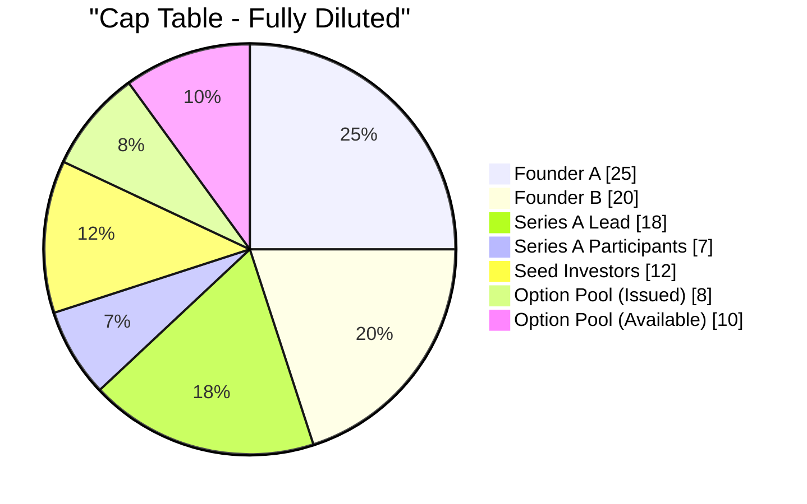
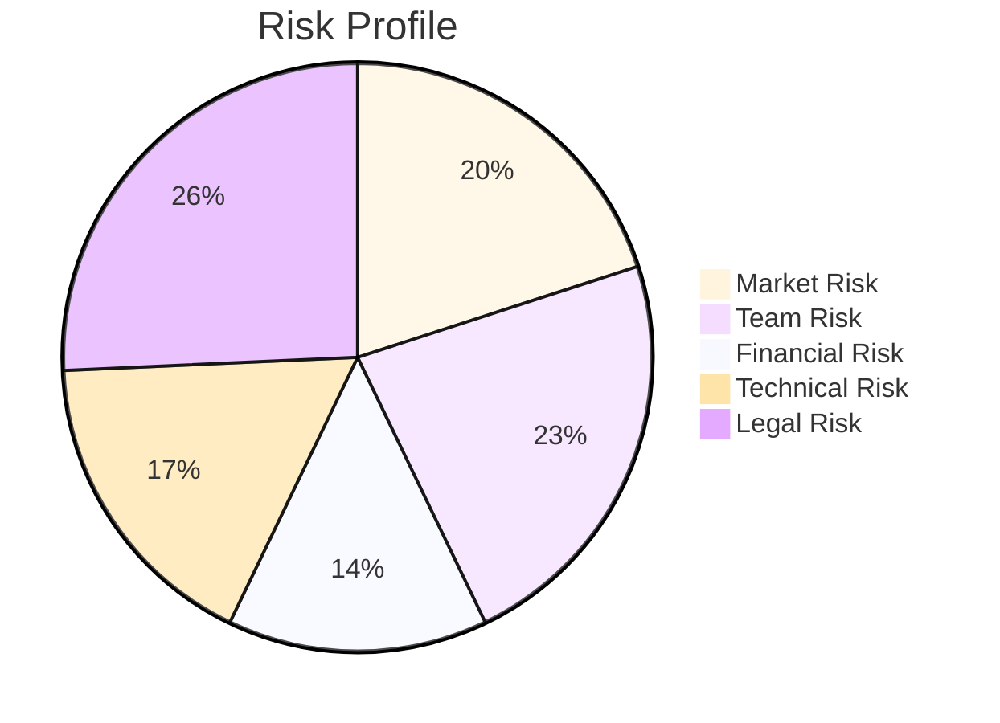
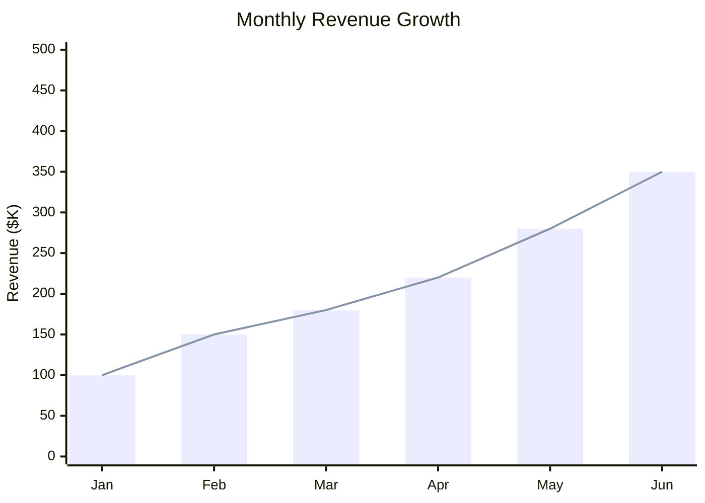
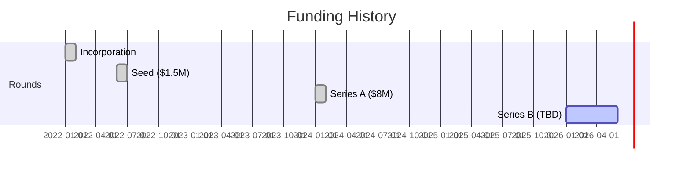
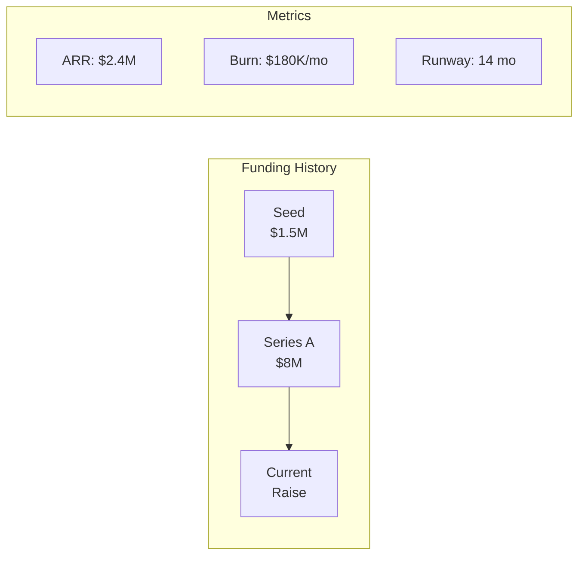
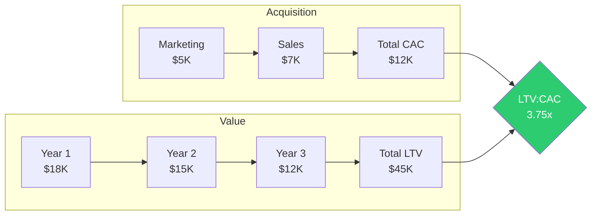
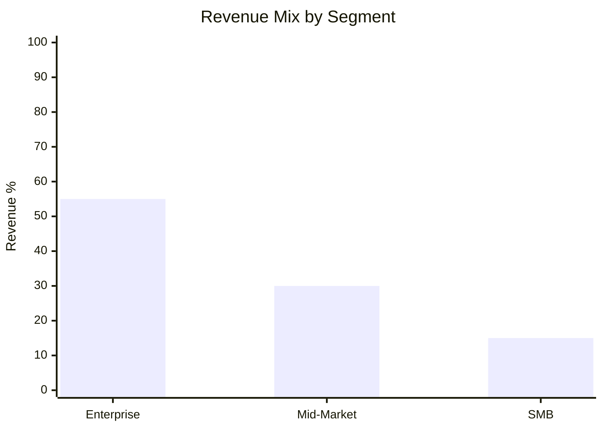

# Mermaid Chart Templates

## Ownership Pie Chart

```mermaid
pie showData
    title "Cap Table - Fully Diluted"
    "Founder A" : 25
    "Founder B" : 20
    "Series A Lead" : 18
    "Series A Participants" : 7
    "Seed Investors" : 12
    "Option Pool (Issued)" : 8
    "Option Pool (Available)" : 10
```

## Risk Radar

```mermaid
%%{init: {"theme": "base"}}%%
pie title Risk Profile
    "Market Risk" : 7
    "Team Risk" : 8
    "Financial Risk" : 5
    "Technical Risk" : 6
    "Legal Risk" : 9
```

## Revenue Growth Chart

```mermaid
xychart-beta
    title "Monthly Revenue Growth"
    x-axis [Jan, Feb, Mar, Apr, May, Jun]
    y-axis "Revenue ($K)" 0 --> 500
    bar [100, 150, 180, 220, 280, 350]
    line [100, 150, 180, 220, 280, 350]
```

## Funding Timeline

```mermaid
gantt
    title Funding History
    dateFormat  YYYY-MM
    section Rounds
    Incorporation    :done, 2022-01, 2022-02
    Seed ($1.5M)     :done, 2022-06, 2022-07
    Series A ($8M)   :done, 2024-01, 2024-02
    Series B (TBD)   :active, 2026-01, 2026-06
```

## Funding Flow

```mermaid
flowchart LR
    subgraph Funding History
    A[Seed<br/>$1.5M] --> B[Series A<br/>$8M]
    B --> C[Current<br/>Raise]
    end

    subgraph Metrics
    D[ARR: $2.4M]
    E[Burn: $180K/mo]
    F[Runway: 14 mo]
    end
```

## Unit Economics Flow

```mermaid
flowchart LR
    subgraph Acquisition
    A[Marketing<br/>$5K] --> B[Sales<br/>$7K]
    B --> C[Total CAC<br/>$12K]
    end

    subgraph Value
    D[Year 1<br/>$18K] --> E[Year 2<br/>$15K]
    E --> F[Year 3<br/>$12K]
    F --> G[Total LTV<br/>$45K]
    end

    C --> H{LTV:CAC<br/>3.75x}
    G --> H

    style H fill:#2ecc71,color:#fff
```

## Revenue Composition

```mermaid
xychart-beta
    title "Revenue Mix by Segment"
    x-axis ["Enterprise", "Mid-Market", "SMB"]
    y-axis "Revenue %" 0 --> 100
    bar [55, 30, 15]
```
