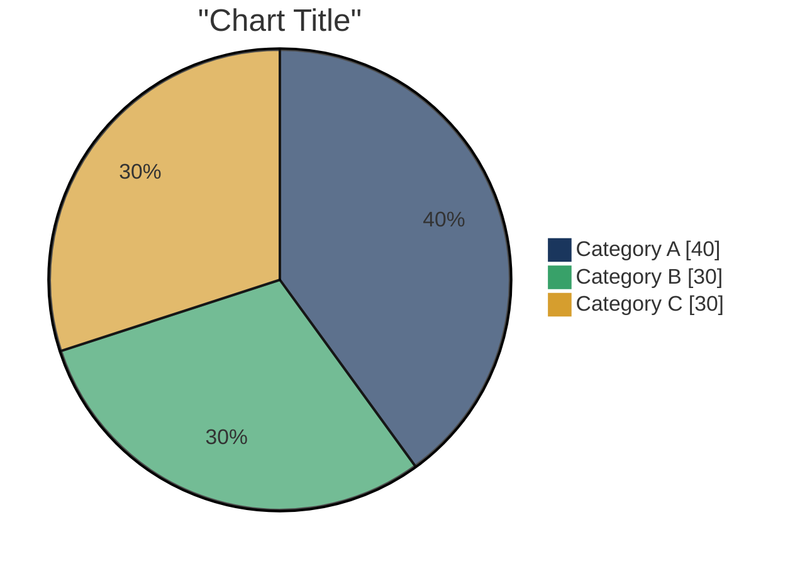
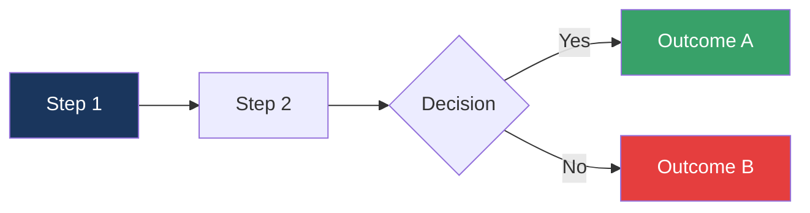
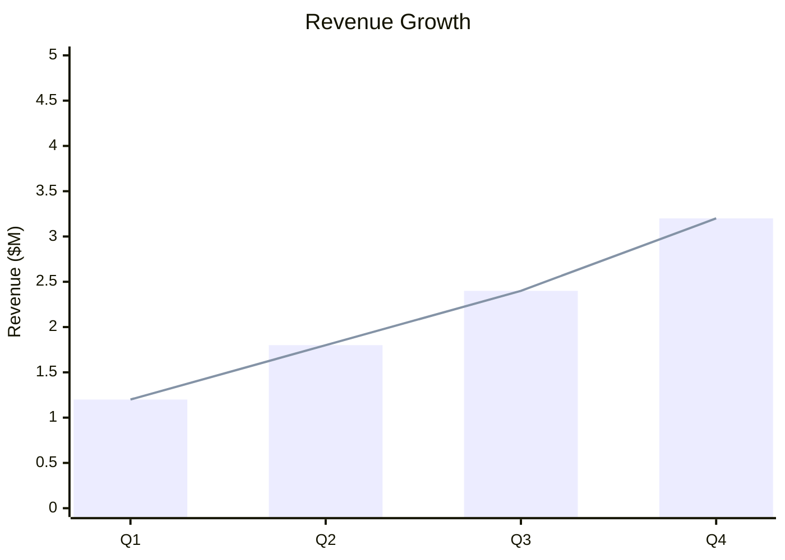

# Crowley Capital Report Style Guide

## Brand Colors

| Color | Hex | Usage |
|-------|-----|-------|
| **Navy** | `#1a365d` | Headers, primary text, chart emphasis |
| **Gold** | `#d69e2e` | Accents, highlights, borders |
| **Green** | `#38a169` | Positive indicators (🟢) |
| **Red** | `#e53e3e` | Negative indicators (🔴) |
| **Gray** | `#718096` | Secondary text, labels |
| **Light** | `#f7fafc` | Backgrounds, alternating rows |

## Typography

| Element | Font | Size | Weight |
|---------|------|------|--------|
| Report Title | Helvetica | 28pt | Bold |
| Section Headers | Helvetica | 18pt | Bold |
| Subsections | Helvetica | 14pt | Bold |
| Body Text | Helvetica | 10pt | Regular |
| Metric Values | Helvetica | 24pt | Bold |
| Metric Labels | Helvetica | 9pt | Regular |
| Footer | Helvetica | 8pt | Regular |

## Status Indicators

### Traffic Light System

| Status | Icon | Color | Meaning |
|--------|------|-------|---------|
| Good | 🟢 | Green | Above target, healthy |
| Caution | 🟡 | Gold | Near target, monitor |
| Risk | 🔴 | Red | Below target, concern |

### Score Bars

```
████████░░  8/10 — Strong
██████░░░░  6/10 — Moderate  
████░░░░░░  4/10 — Concern
```

## Table Styling

### Header Row
- Background: Navy (`#1a365d`)
- Text: White
- Font: Helvetica Bold

### Data Rows
- Alternating: White / Light Gray
- Text: Black
- Alignment: Numbers right, text left

### Example

```
┌─────────────────────────────────────────────────────────────────┐
│  METRIC         │  VALUE      │  BENCHMARK  │  STATUS          │
├─────────────────┼─────────────┼─────────────┼──────────────────┤
│  ARR            │  $2.4M      │  $2.0M      │  🟢 Above        │
│  Growth Rate    │  142%       │  100%       │  🟢 Strong       │
│  Burn Rate      │  $180K/mo   │  $150K/mo   │  🟡 Monitor      │
│  Runway         │  14 months  │  18 months  │  🟡 Adequate     │
└─────────────────┴─────────────┴─────────────┴──────────────────┘
```

## Page Layout

### Margins
- Top: 0.75 inch
- Bottom: 0.75 inch
- Left: 0.75 inch
- Right: 0.75 inch

### Header (Page 2+)
- Company name left-aligned
- "Crowley Capital" right-aligned
- Thin gold separator line

### Footer (All Pages)
- Page number centered
- "CONFIDENTIAL" right-aligned

## Mermaid Chart Styling

### Pie Charts


### Flow Charts


### XY Charts


## Report Sections

### 1. Cover Page
- Company name (large, centered)
- "Due Diligence Report" subtitle
- Crowley Capital attribution
- Date
- Confidentiality notice

### 2. Executive Summary (1 page)
- 4 key metrics in boxes at top
- Risk score with bar visualization
- Investment recommendation
- 3 strengths / 3 risks bullets

### 3. Financial Metrics (2-3 pages)
- Revenue trend chart
- Unit economics table
- Burn and runway visualization
- Cohort analysis (if applicable)

### 4. Cap Table (1-2 pages)
- Ownership pie chart
- Top stakeholders table
- Option pool status
- Round modeling summary

### 5. Risk Assessment (1-2 pages)
- 11-Risks scorecard with bars
- Risk radar chart
- Key concerns narrative
- Mitigation recommendations

### 6. Appendix
- Full financial tables
- Complete cap table
- Data sources
- Methodology notes

## File Naming

```
{company_name}_diligence_{date}_{version}.pdf

Examples:
- acme_corp_diligence_20260103_v1.pdf
- techstartup_diligence_20260103_ic.pdf
- sample_company_diligence_20260103_draft.pdf
```
